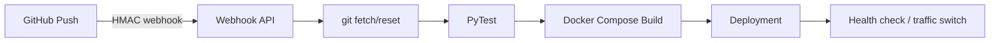

# Automated CI/CD Deployment Pipeline

A deliberately small CI/CD orchestrator written in Python with strict separation of configuration, command execution, webhook validation, testing, and deployment.

## Flow



## Quick start

```bash
python3 -m venv .venv
source .venv/bin/activate
pip install -r requirements.txt
export GITHUB_WEBHOOK_SECRET='dev-secret'
export REPO_DIR="$PWD"
python3 -m pipeline.webhook
```

Test the suite:
```bash
pytest -q
```

The compose file demonstrates isolated container execution. In a real environment, point the webhook at a deployment host and use a reverse proxy/TLS.

## Zero-downtime model

The sample compose deployment is intentionally conservative. A production implementation should run `blue` and `green` versions simultaneously, health-check the new version, switch the reverse proxy upstream, then drain and remove the old version. This avoids pretending that `docker compose up` alone guarantees zero downtime.

## Security and reliability

GitHub's HMAC SHA-256 signature is verified before work starts. Secrets belong in environment variables or a secret manager. Commands are passed as argument arrays rather than shell strings. For production, add a job queue, idempotency keys, deployment locks, health checks, rollback, artifact pinning, least-privilege Docker access, and persistent structured logs.
